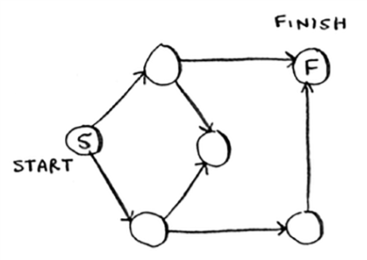
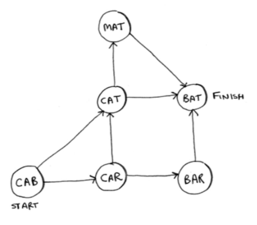

Run the breadth-first search algorithm on each of these graphs to find the solution.

1. Find the length of the shortest path from start to finish.

  > See the code in `breadthFirstSearch.js` and `breadthFirstSearch.test.js`, along with the accompanying data that form the graphs in `names.json`, `race.json` and `words.json`. The algorithm accepts either an Object or Array as a graph, a matching function, and an optional starting point. The algorithm returns the match node in the graph, rather than the number of steps between nodes (which is also what the example code in the book does).

2. Find the length of the shortest path from "cab" to "bat".

