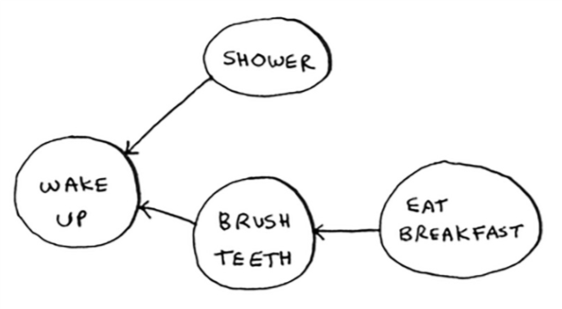
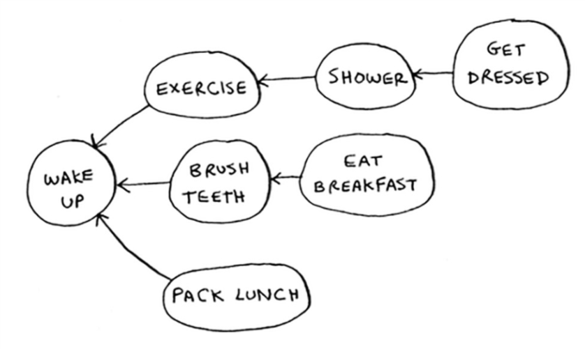
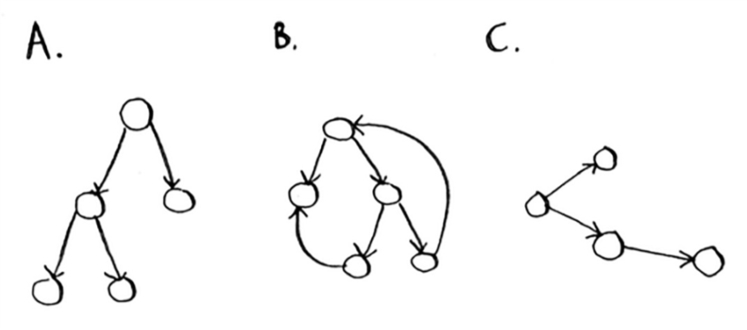

Run the breadth-first search algorithm on each of these graphs to find the solution.

1. Find the length of the shortest path from start to finish.

  > See the code in `breadthFirstSearch.js` and `breadthFirstSearch.test.js`, along with the accompanying data that form the graphs in `names.json`, `race.json` and `words.json`. The algorithm accepts either an Object or Array as a graph, a matching function, and an optional starting point. The algorithm returns the match node in the graph, rather than the number of steps between nodes (which is also what the example code in the book does).

2. Find the length of the shortest path from "cab" to "bat".

Here’s a small graph of my morning routine:

3. For these three lists, mark whether each one is valid or invalid:

  * **List A**
    1. wake up
    2. shower
    3. eat breakfast
    4. brush teeth

  * **List B**
    1. wake up
    2. brush teeth
    3. eat breakfast
    4. shower

  * **List C**
    1. shower
    2. wake up
    3. brush teeth
    4. eat breakfast

  > List A is invalid because `eat breakfast` cannot be ordered before `brush teeth`.

  > List B is valid. No items violate the ordering of the graph.

  > List C is invalid. `wake up` must be the first item in the list.

4. Here's a larger graph. Make a valid list for this graph.

  > 1. wake up
  > 2. exercise
  > 3. shower
  > 4. brush teeth
  > 5. get dressed
  > 6. eat breakfast
  > 7. pack lunch

5. Which of the following graphs are also trees?

  > Graphs A and C are trees, but graph B is not, because graph B has edges that point back to earlier nodes.
